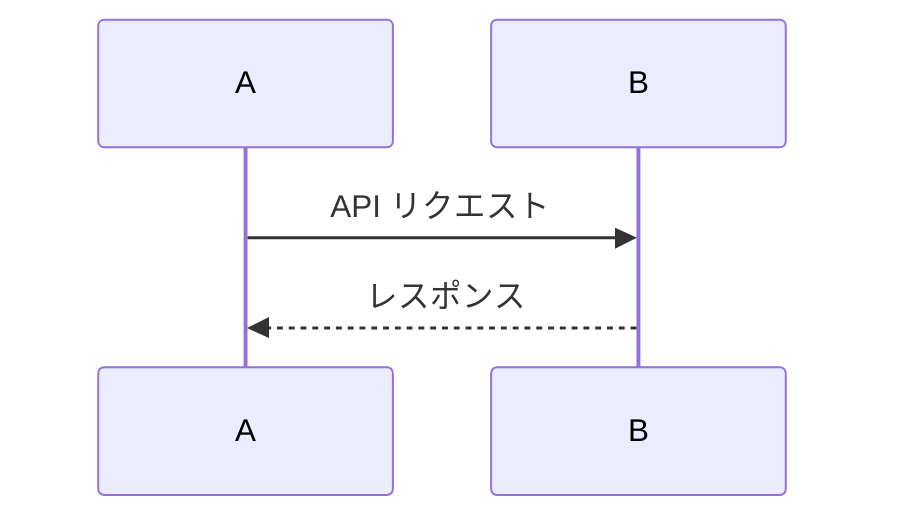

# Marp Slide Deck Authoring

## 概要
Markdown ベースのプレゼン資料を **Marp** で作成します。構造とワークフローを統一しておくことで、誰でも簡単にスライドを追加・変換・公開できるようにします。

## ディレクトリ構成
```
slides/
  ├── src/          # Markdown 原稿 (.md)
  ├── theme/        # 共通 / カスタム CSS テーマ
  └── output/       # 生成された HTML / PDF / PPTX 等
```

## Markdown テンプレート
各スライドは `slides/src/<topic>.md` に配置し、冒頭に以下の Front Matter を置きます。
```
---
marp: true        # Marp であることを明示
paginate: true    # ページ番号を自動付与
---
```
ページ区切りは水平線 `---` を 1 行だけ挿入してください。

## テーマ指定のベストプラクティス
1. プロダクト・ブランド色を出す場合は、`slides/theme/brand.css` を作成。
2. Markdown 先頭または CLI で `theme: ./theme/brand.css` を指定。
3. 共通フォントやロゴ配置もここで行います。

## 変換ワークフロー
ローカルでは以下のコマンドを推奨します。
```bash
# HTML に変換してブラウザ確認
npx @marp-team/marp-cli slides/src/xxx.md -o slides/output/xxx.html --theme slides/theme/brand.css --preview

# PDF(＋ノート) を生成
npx @marp-team/marp-cli slides/src/xxx.md -o slides/output/xxx.pdf --pdf --pdf-notes
```

## 図・Mermaid の埋め込み
Markdown なので画像やダイアグラムを簡単に追加できます。

### 画像（PNG / SVG など）
1. `slides/assets/` 配下に画像ファイルを配置。
2. Markdown 内で相対パス指定：
   ```markdown
   
   ```

### Mermaid 図
Marp は Markdown 内の ```mermaid ブロックをそのままレンダリングできます（HTML/PDF 出力時も反映）。
```markdown

```

> Mermaid が PDF/PPTX に含まれない場合は、Chrome/Edge など最新ブラウザで再変換してください。

---
シンプルかつ拡張性の高いスライド開発が可能になります。
