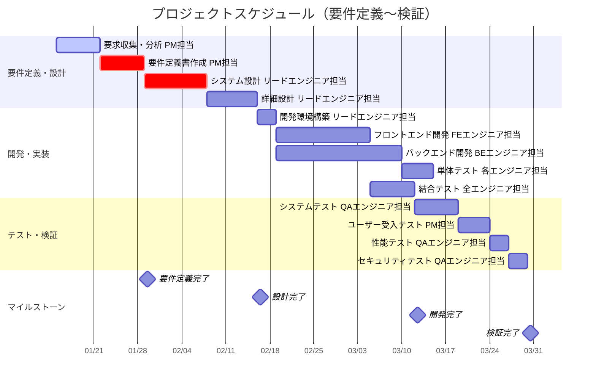
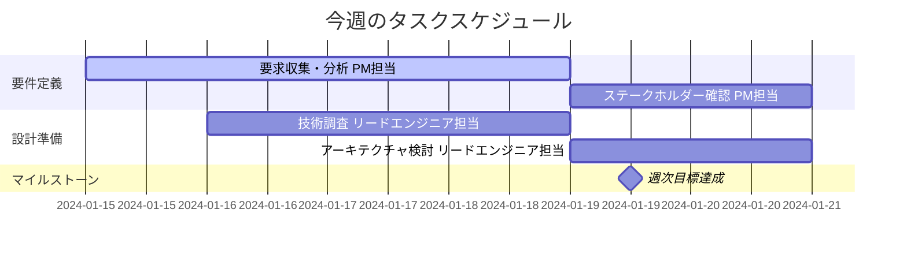

# プロジェクト タスク割り振り・スケジュール

このファイルはプロジェクトのタスク割り振りとスケジュールをMermaid Gantt形式で管理します。

## 📅 プロジェクト全体スケジュール

## 📊 今週のタスク詳細

## 📝 タスク詳細情報

### 今週のタスク
- **要求収集・分析**: ステークホルダーへのヒアリング実施、要求の整理・分析
- **ステークホルダー確認**: 収集した要求の妥当性確認とフィードバック収集
- **技術調査**: システム実現のための技術要素の調査・比較検討
- **アーキテクチャ検討**: システム全体構成とアーキテクチャの方向性検討

### 来週の予定
- **要件定義書作成**: 分析結果をもとに要件定義書の作成開始
- **システム設計準備**: 基本設計に向けた準備作業

## 📋 タスク管理ルール

### 状態の定義
- `active`: 現在進行中のタスク
- `done`: 完了済みタスク
- `crit`: クリティカルパス上のタスク
- `milestone`: マイルストーン

### 更新手順
1. 毎日の進捗に合わせてタスクの状態を更新
2. 遅延が発生した場合は依存するタスクの日程も調整
3. 新しいタスクが追加される場合は適切なセクションに配置
4. 完了したタスクは`done`状態に変更

### 担当者表記
タスク名に担当者を必ず含めること: `[タスク名] (担当: [氏名])`

---
**最終更新**: 2024-01-15  
**更新者**: Project Manager
