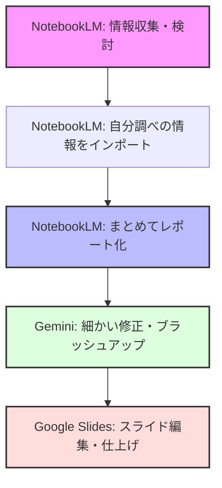

# プレゼン資料作成フロー

効率的かつ質の高いプレゼン資料を作成するための、AIツール（NotebookLM / Gemini）とGoogleスライドを組み合わせたワークフローです。

---

## 🎨 ワークフローの概要

1. **情報収集・整理** (NotebookLM)
2. **レポート生成** (NotebookLM)
3. **推敲・ブラッシュアップ** (Gemini)
4. **スライド作成・最終編集** (Google Slides)

---

## 🛠 各ステップの詳細

### 1. 情報ソースの検討と収集 (NotebookLM)
- **ナレッジの集約**: NotebookLMを活用して情報の取捨選択を行い、信頼できるソースを特定します。
- **独自情報の追加**: 自身で調査・作成したメモやデータをアップロードし、コンテキスト（文脈）を強化します。

### 2. レポートの自動生成 (NotebookLM)
- **骨子の作成**: インポートした複数のソースをNotebookLMに統合させ、全体をまとめたレポート形式のドキュメントを生成します。

### 3. 内容の精査・修正 (Gemini)
- **詳細な調整**: NotebookLMで作成したレポートをGeminiに渡し、論理構成のチェックや表現の細かい修正、補足情報の追加を行います。
- **構成案の作成**: プレゼンに適した「スライド構成案」へと落とし込みます。

### 4. スライド化とデザイン (Google Slides)
- **最終編集**: Geminiで整えた構成案をもとに、Googleスライドでビジュアル化（図解・画像挿入）やレイアウト調整を行い、完成させます。

---
*Created with the help of AI.*